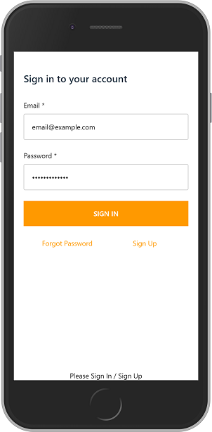
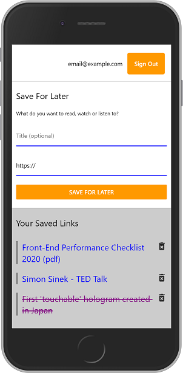

# react-native-save-links-app

React Native app to save links for later.

Add a new hyperlink to a list. When links open in browser they are flagged as visited. Requires signup with Amazon Cognito and supports multiple users.

[](./screenshots/react-native-save-links-screen1.png)
[](./screenshots/react-native-save-links-screen2.png)

Tested on Android. Uses Amazon Cognito to authenticate and authorizes all GraphQL CRUD operations.


## Setup

*Setup of this project will not work at this time* only because, some Amplify configuration files have been excluded from this repository.

```bash
npm install
npm install expo -g
expo start
```
